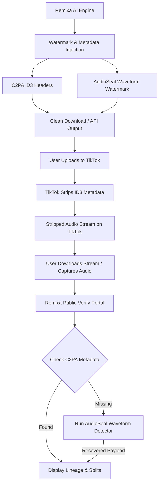

# Remixa Double-Shield Launch Strategy

This document details the spatial positioning, compliance architecture, and execution roadmap for launching Remixa into production as the first EU AI Act compliant, short-form native sound lab.

## 1. Product Positioning: The "Double-Shield" Advantage

Existing AI music generators (e.g., Suno, Udio) rely on standard MP3/WAV file downloads. If these files are uploaded to TikTok, YouTube, or Instagram, the social platforms' transcoding engines strip all metadata headers, including C2PA provenance signatures. This makes the content untraceable and non-compliant with the upcoming EU AI Act transparency rules (Article 50), which come into force on August 2, 2026.

Remixa secures a unique space by implementing **Double-Shield Compliance**:

1. **Active C2PA Provenance Metadata**: Injected into the ID3 metadata tags (GEOB frames) of generated audio files, preserving high-integrity chain of custody.
2. **AudioSeal Waveform Watermarking**: A deep-learning-based watermark embedded directly into the audio waveform using Meta's AudioSeal. This watermark survives lossy MP3 compression, speed variations, and re-encoding on short-form platforms.

---

## 2. Spatial Competition Analysis (Hotelling's Model)

In the two-dimensional market space of **Regulatory Compliance** and **Social-Native Workflow Integration**, Remixa positions itself in a completely uncontested sector:

* **Suno/Udio**: High music fidelity, but low compliance (under lawsuit) and low social workflow integration (raw downloads only).
* **Soundraw/Mubert**: Royalty-free but geared towards traditional B2B/games, not short-form TikTok remix ecosystems.
* **AITuber/Freebeat**: High video-native automation but zero provenance and compliance tracking.
* **Remixa**: Fully compliant double-shield audio, automated ledger splits, direct TikTok posting API.

---

## 3. Implementation Roadmap

### Phase 1: Waveform Watermark Implementation
* Install and benchmark `audioseal`.
* Modify backend inference script (`inference.py`) to inject the `generation_id` as the 16-bit watermark payload.
* Expose `/api/c2pa/verify-waveform` to detect watermark signatures in uploaded files.

### Phase 2: Double-Shield UI Portal
* Modify `/verify` route in the Next.js frontend to perform dual checks: first checking C2PA metadata, and falling back to the waveform verification endpoint if metadata is stripped.
* Visualize the original creator's lineage, royalty splits, and prompt tree.

### Phase 3: Transaction Hardening & Stripe Sync
* Enable Stripe webhook listeners for failed payouts to perform ledger reversals.
* Configure daily cron runs to disburse queued instant payouts to onboarded creators.
